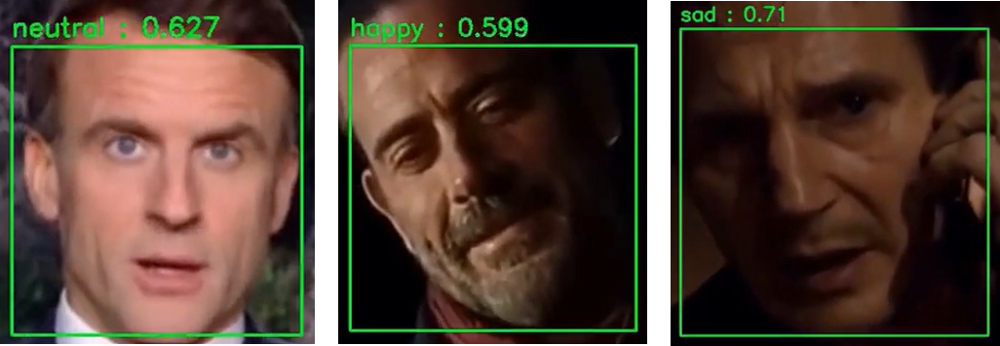

# Reconnaissance des émotions avec des données multimodales

Projet de laboratoire effectué dans le cadre du Master 1 IISC à CY Cergy Paris Université. L'objectif est de développer un modèle de reconnaissance des émotions en utilisant trois modalités de données :
* 🖼️ **Image** (expression faciale)
* 🔊 **Son** (intonation de la voix)
* 📝 **Texte** (sens de ce qui est prononcé)
---
Le dépôt est organisé en quatre sous-dossiers, chacun correspondant à une modalité de données, ainsi qu'un dernier intégrant les trois modèles pour traiter des vidéos.

# Quelques exemples 🎥
Quelques exemples illustrant les résultats obtenus à l'issue du projet :
* [Extrait vœux d'Emmanuel Macron](https://www.youtube.com/watch?v=x-yZbN2wAC4)
* [Extrait série The Walking Dead](https://www.youtube.com/watch?v=Z7o5usIYwFQ)
* [Extrait film Taken](https://www.youtube.com/watch?v=5pyHxlb3uWE)
